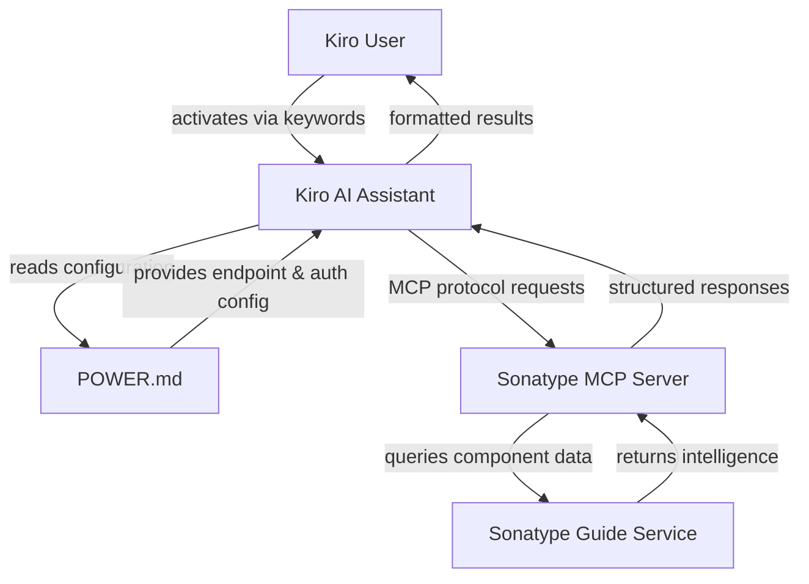
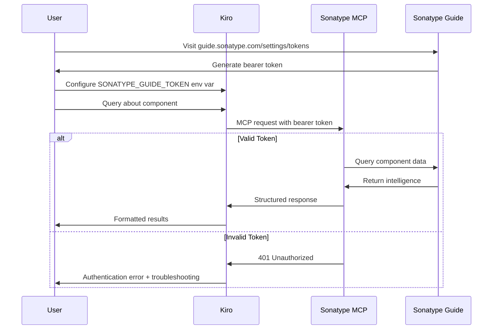

# Design Document: Sonatype Guide Kiro Power

## Overview

The Sonatype Guide Kiro Power is a documentation and configuration package that enables Kiro users to access Sonatype's component intelligence through an MCP (Model Context Protocol) server. This power provides three key capabilities:

1. **Component Version Research**: Detailed information about specific component versions
2. **Latest Version Checking**: Quick access to the most recent releases
3. **Upgrade Recommendations**: Sonatype's curated recommendations based on security, stability, and compatibility

The power consists of a single POWER.md file that contains:
- YAML frontmatter with MCP server configuration
- Onboarding instructions for authentication setup
- Steering instructions that guide Kiro on when and how to use each tool
- Workflow examples for common use cases

This is a documentation-only power - it does not include custom code or steering files. The MCP server is hosted by Sonatype at https://mcp.guide.sonatype.com/mcp and requires a bearer token for authentication.

## Architecture

### System Components



### Component Responsibilities

**POWER.md File**:
- Contains YAML frontmatter with power metadata and MCP server configuration
- Provides onboarding instructions for obtaining and configuring bearer tokens
- Documents the three available tools and their use cases
- Includes steering instructions to guide Kiro's tool selection
- Defines activation keywords for automatic power enablement

**Sonatype MCP Server** (external, hosted by Sonatype):
- Exposes three tools via MCP protocol: getComponentVersion, getLatestComponentVersion, getRecommendedComponentVersions
- Handles authentication via bearer token
- Queries Sonatype Guide service for component intelligence
- Returns structured data about components, versions, vulnerabilities, and licenses

**Kiro AI Assistant** (existing system):
- Reads POWER.md frontmatter to auto-register the MCP server
- Activates the power when keywords are detected in user queries
- Follows steering instructions to select appropriate tools
- Formats and presents results to users

### Data Flow

1. **Power Activation**: User mentions keywords like "component", "dependency", "sonatype", or "vulnerability"
2. **Configuration Loading**: Kiro reads POWER.md frontmatter to get MCP endpoint and auth requirements
3. **Tool Selection**: Kiro uses steering instructions to choose the appropriate tool based on user intent
4. **MCP Request**: Kiro sends authenticated request to Sonatype MCP server
5. **Data Retrieval**: MCP server queries Sonatype Guide and returns component intelligence
6. **Response Formatting**: Kiro presents security, licensing, and version information to user

## Components and Interfaces

### POWER.md Structure

The POWER.md file follows this structure:

```markdown
---
name: "Sonatype Guide"
description: "Research component versions, check for latest releases, and get upgrade recommendations"
keywords: ["sonatype", "component", "dependency", "dependencies", "version", "versions", "security", "vulnerability", "vulnerabilities", "license", "licensing", "npm", "maven", "upgrade", "nexus", "package", "packages", "supply chain", "cve", "outdated", "update", "patch", "artifact", "library", "libraries", "pypi", "nuget", "gradle", "pom", "cargo", "rust", "cocoapods", "swift", "composer", "php", "conan", "conda", "cran", "alpine", "bower", "debian", "drupal", "rpm", "rubygems", "ruby", "golang", "go"]
mcpServers:
  - endpoint: "https://mcp.guide.sonatype.com/mcp"
    authType: "bearer"
    authEnvVar: "SONATYPE_GUIDE_TOKEN"
---

# Sonatype Guide Power

[Onboarding Instructions]
[Steering Instructions]
[Workflow Examples]
```

### Frontmatter Schema

**Required Fields**:
- `name` (string): Display name for the power
- `description` (string): Brief explanation of power capabilities
- `keywords` (array of strings): Activation keywords for automatic power enablement
- `mcpServers` (array of objects): MCP server configuration

**MCP Server Configuration**:
- `endpoint` (string): URL of the MCP server
- `authType` (string): Authentication method ("bearer")
- `authEnvVar` (string): Environment variable name for the bearer token

### Tool Interfaces

The Sonatype MCP server exposes three tools. While we don't implement these tools (they're provided by Sonatype), we document their interfaces for steering instructions:

**getComponentVersion**:
- Purpose: Retrieve detailed information about a specific component version
- Parameters: component identifier (e.g., "pkg:npm/lodash@4.17.21"), version
- Returns: Security vulnerabilities, licensing information, metadata, release date
- Use case: Evaluating a specific version before adoption or during security audit

**getLatestComponentVersion**:
- Purpose: Retrieve information about the most recent version of a component
- Parameters: component identifier (e.g., "pkg:npm/lodash")
- Returns: Latest version number, release date, security status, licensing
- Use case: Checking if updates are available for current dependencies

**getRecommendedComponentVersions**:
- Purpose: Get Sonatype's recommended versions for a component
- Parameters: component identifier (e.g., "pkg:npm/lodash")
- Returns: List of recommended versions with rationale (security, stability, compatibility)
- Use case: Planning dependency upgrades or selecting versions for new projects

### Authentication Flow



## Data Models

### Power Metadata Model

```typescript
interface PowerMetadata {
  name: string;                    // Display name
  description: string;             // Brief capability description
  keywords: string[];              // Activation keywords
  mcpServers: MCPServerConfig[];   // MCP server configurations
}

interface MCPServerConfig {
  endpoint: string;      // MCP server URL
  authType: "bearer";    // Authentication method
  authEnvVar: string;    // Environment variable for token
}
```

### Documentation Sections Model

```typescript
interface PowerDocumentation {
  frontmatter: PowerMetadata;
  onboarding: OnboardingSection;
  steering: SteeringSection;
  workflows: WorkflowSection[];
}

interface OnboardingSection {
  tokenAcquisition: string;      // How to get bearer token
  configuration: string;          // How to configure Kiro
  verification: string;           // How to test setup
  troubleshooting: string;        // Common issues and solutions
}

interface SteeringSection {
  toolDescriptions: ToolDescription[];
  selectionGuidance: string;      // When to use each tool
  bestPractices: string[];        // Usage recommendations
}

interface ToolDescription {
  name: string;                   // Tool name
  purpose: string;                // What it does
  parameters: string;             // What inputs it needs
  returns: string;                // What it provides
  useCases: string[];            // When to use it
}

interface WorkflowSection {
  title: string;                  // Workflow name
  scenario: string;               // Use case description
  steps: string[];                // Step-by-step instructions
  toolsUsed: string[];           // Which tools to invoke
}
```

### Component Intelligence Model

While we don't implement the MCP server, understanding the data model helps write better steering instructions:

```typescript
interface ComponentVersion {
  identifier: string;             // e.g., "pkg:npm/lodash@4.17.21"
  version: string;                // e.g., "4.17.21"
  releaseDate: string;            // ISO 8601 date
  vulnerabilities: Vulnerability[];
  licenses: License[];
  metadata: ComponentMetadata;
}

interface Vulnerability {
  id: string;                     // CVE or other identifier
  severity: "critical" | "high" | "medium" | "low";
  description: string;
  fixedInVersion?: string;
}

interface License {
  name: string;                   // e.g., "MIT", "Apache-2.0"
  spdxId: string;
  url: string;
}

interface ComponentMetadata {
  description: string;
  homepage?: string;
  repository?: string;
  downloads?: number;
}

interface RecommendedVersion {
  version: string;
  rationale: string;              // Why this version is recommended
  securityScore: number;
  stabilityScore: number;
  compatibilityNotes: string;
}
```


## Correctness Properties

*A property is a characteristic or behavior that should hold true across all valid executions of a system—essentially, a formal statement about what the system should do. Properties serve as the bridge between human-readable specifications and machine-verifiable correctness guarantees.*

### Property 1: Frontmatter Schema Completeness

*For any* valid POWER.md file, the YAML frontmatter should contain all required fields (name, description, keywords, mcpServers) with correct types, and the mcpServers configuration should include endpoint, authType, and authEnvVar fields.

**Validates: Requirements 1.2, 9.1, 9.2, 9.3, 9.4, 9.5**

### Property 2: Keyword Category Coverage

*For any* valid POWER.md file, the keywords array should include at least one keyword from each of the four required categories: component research (component, dependency, dependencies, version, versions, artifact, library, libraries), Sonatype services (sonatype, nexus), security and licensing (vulnerability, vulnerabilities, license, licensing, security, cve, supply chain), and package management (npm, maven, upgrade, package, packages, outdated, update, patch, pypi, nuget, gradle, pom).

**Validates: Requirements 6.1, 6.2, 6.3, 6.4**

### Example-Based Tests

The following requirements are best validated through specific example tests rather than universal properties, as they verify the presence of particular content:

**Documentation Structure Examples**:
- Verify POWER.md contains frontmatter, onboarding, and steering sections (Requirement 1.1)
- Verify onboarding includes token acquisition URL (Requirement 1.3)
- Verify onboarding includes setup verification instructions (Requirement 1.4)
- Verify steering describes all three tools (Requirement 1.5)

**Configuration Examples**:
- Verify MCP endpoint is https://mcp.guide.sonatype.com/mcp (Requirement 2.1)
- Verify authType is "bearer" (Requirement 2.2)
- Verify mcpServers configuration exists (Requirement 2.3)
- Verify documentation mentions user-provided tokens (Requirement 2.4)

**Tool Documentation Examples**:
- Verify getComponentVersion is documented with purpose and parameters (Requirements 3.1, 3.2, 3.3, 3.4)
- Verify getLatestComponentVersion is documented with purpose and parameters (Requirements 4.1, 4.2, 4.3)
- Verify getRecommendedComponentVersions is documented with purpose and parameters (Requirements 5.1, 5.2, 5.3, 5.4)

**Workflow Examples**:
- Verify workflow for researching specific versions exists (Requirement 7.1)
- Verify workflow for checking updates exists (Requirement 7.2)
- Verify workflow for planning upgrades exists (Requirement 7.3)
- Verify workflow for security evaluation exists (Requirement 7.4)

**Troubleshooting Examples**:
- Verify connection testing instructions exist (Requirement 8.1)
- Verify authentication error documentation exists (Requirement 8.2)
- Verify token regeneration instructions exist (Requirement 8.3)
- Verify token configuration troubleshooting exists (Requirement 8.4)

**Best Practices Examples**:
- Verify recommendation to start with getRecommendedComponentVersions (Requirement 10.1)
- Verify recommendation to use getLatestComponentVersion for updates (Requirement 10.2)
- Verify recommendation to use getComponentVersion for detailed analysis (Requirement 10.3)
- Verify advice to consider security and licensing (Requirement 10.4)

## Error Handling

### Authentication Errors

**Invalid or Missing Token**:
- Error: 401 Unauthorized from MCP server
- Cause: Bearer token is missing, expired, or invalid
- Resolution: User must obtain a new token from https://guide.sonatype.com/settings/tokens and configure SONATYPE_GUIDE_TOKEN environment variable
- Documentation: POWER.md includes troubleshooting section with step-by-step token regeneration

**Token Configuration Errors**:
- Error: Environment variable not set
- Cause: SONATYPE_GUIDE_TOKEN not configured in Kiro
- Resolution: User must set environment variable with their bearer token
- Documentation: POWER.md includes configuration verification steps

### MCP Server Errors

**Network Connectivity**:
- Error: Connection timeout or network error
- Cause: Cannot reach https://mcp.guide.sonatype.com/mcp
- Resolution: Check network connectivity, verify endpoint URL is correct
- Documentation: POWER.md includes connection testing instructions

**Invalid Component Identifier**:
- Error: Component not found or invalid format
- Cause: Component identifier doesn't follow expected format (e.g., pkg:npm/package-name)
- Resolution: Use correct package URL format for the ecosystem
- Documentation: POWER.md includes examples of valid component identifiers

**Rate Limiting**:
- Error: 429 Too Many Requests
- Cause: Exceeded Sonatype Guide API rate limits
- Resolution: Wait before retrying, consider upgrading Sonatype Guide plan
- Documentation: POWER.md mentions rate limits and best practices

### Documentation Validation Errors

**Missing Required Frontmatter Fields**:
- Error: Power cannot be registered
- Cause: POWER.md frontmatter is missing required fields
- Resolution: Ensure name, description, keywords, and mcpServers are present
- Validation: Property 1 tests for complete frontmatter schema

**Invalid YAML Syntax**:
- Error: Cannot parse frontmatter
- Cause: YAML syntax errors in frontmatter
- Resolution: Validate YAML syntax, ensure proper indentation
- Validation: Parser should provide clear error messages

**Missing Keyword Categories**:
- Error: Power may not activate appropriately
- Cause: Keywords array doesn't cover all required categories
- Resolution: Add keywords from missing categories
- Validation: Property 2 tests for keyword category coverage

## Testing Strategy

### Dual Testing Approach

This feature requires both unit tests and property-based tests to ensure comprehensive coverage:

**Unit Tests**: Verify specific examples, edge cases, and error conditions
- Test specific POWER.md content examples
- Test specific frontmatter configurations
- Test specific error scenarios
- Test integration with Kiro's power loading system

**Property Tests**: Verify universal properties across all inputs
- Test frontmatter schema validation across various valid configurations
- Test keyword category coverage across different keyword combinations
- Run minimum 100 iterations per property test to ensure comprehensive coverage

### Property-Based Testing Configuration

For this project, we'll use a property-based testing library appropriate for the implementation language. Each property test must:

1. Run a minimum of 100 iterations (due to randomization)
2. Reference its corresponding design document property
3. Use the tag format: **Feature: sonatype-guide-power, Property {number}: {property_text}**

### Test Coverage Requirements

**Property Tests** (2 properties):
1. **Property 1: Frontmatter Schema Completeness**
   - Generate various valid frontmatter configurations
   - Verify all required fields are present and correctly typed
   - Verify mcpServers configuration is complete
   - Tag: **Feature: sonatype-guide-power, Property 1: Frontmatter Schema Completeness**

2. **Property 2: Keyword Category Coverage**
   - Generate various keyword arrays
   - Verify at least one keyword from each required category is present
   - Test with different combinations of keywords
   - Tag: **Feature: sonatype-guide-power, Property 2: Keyword Category Coverage**

**Unit Tests** (example-based):
- Verify POWER.md file structure and sections
- Verify specific configuration values (endpoint URL, authType)
- Verify all three tools are documented
- Verify all four workflows are present
- Verify troubleshooting content exists
- Verify best practices are documented
- Test YAML parsing with valid and invalid syntax
- Test error handling for missing environment variables

### Integration Testing

**Power Loading**:
- Test that Kiro can successfully parse POWER.md frontmatter
- Test that MCP server configuration is correctly extracted
- Test that keywords trigger power activation

**Authentication Flow**:
- Test with valid bearer token (successful authentication)
- Test with invalid bearer token (401 error handling)
- Test with missing token (error message and guidance)

**End-to-End Workflows**:
- Test complete workflow: keyword activation → tool selection → MCP request → response formatting
- Test each of the three tools with sample component identifiers
- Test error scenarios and verify appropriate error messages

### Validation Strategy

**Static Validation**:
- YAML frontmatter syntax validation
- Schema validation for required fields and types
- Content validation for required documentation sections

**Dynamic Validation**:
- Test MCP server connectivity with valid credentials
- Test tool invocation with sample queries
- Test error handling with invalid inputs

**Documentation Validation**:
- Verify all requirements are addressed in documentation
- Verify all tools are documented with examples
- Verify all workflows are complete and actionable
- Verify troubleshooting covers common error scenarios

### Test Execution

Tests should be organized into three suites:

1. **Property Test Suite**: Runs property-based tests with 100+ iterations each
2. **Unit Test Suite**: Runs example-based tests for specific content and configurations
3. **Integration Test Suite**: Runs end-to-end tests with actual MCP server (requires valid token)

The integration test suite should be optional and require explicit configuration, as it depends on external services and valid credentials.
